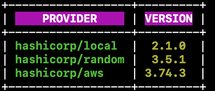
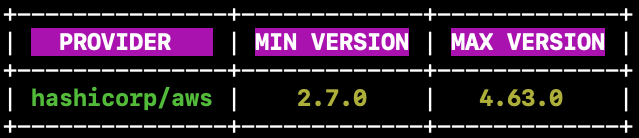

# Providers
The `providers` command can by use in one of two cases:
1. Listing a Terrap Workspace to see what providers are in context.
2. Inspecting the backend to see which Terraform providers are supported.

## Sub-Commands
### get-context
The `get-context` sub-command is used to inspect the current directory Terrap workspace.
The command can be used with the `--filter` flag in order to list specific provider version only.

#### Example:
On executing `terrap providers get-context`, we get the following result:

And on executing `terrap providers get-context --filter aws` we get:

### get-supported
The `get-supported` sub-command is used to inspect the Terrap supported providers and versions.
The command can be used with the `--filter` flag in order to list specific provider version only.

#### Example:
On executing `terrap providers get-supported`, we get the following result:

And on executing `terrap providers get-supported --filter aws` we get:
