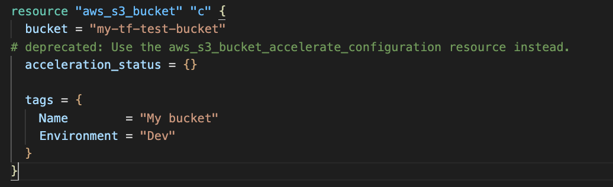

# Scan

Scan is used to find all changes **in a Terrap workspace**</br>
Scan displays its output per file and can generate it in three different ways:
* Human-Readable
* JSON
* Code Annotation - alpha stage

<video width="622" height="325" loop autoplay>
  <source src="images/scan.mp4" type="video/mp4">
  Your browser does not support the video tag.
</video>

## Flags
### Fixed Providers
* **[-f] fixed-providers** - A comma separated list of fixed providers written in the following format: `<provider>:<version>`.</br>
If this flag is used, all other in-context providers are ignored.</br>
Example:
```shell
terrap scan --fixed-providers hashicorp/aws:3.74.3,hashicorp:google:3.90.1
```

### Filtering Options
* **[-p] provider** - Show only provider block changes.
* **[-d] data-sources** - Display only changed data-sources
* **[-r] resources** - Show only resources changes.

### Print Options
* **[-a] anotate** - Annotate the code itself</br>

* **[-j] json** - Print the scaned output as json.</br>
```json
{
        "/Users/yuvalpress/Desktop/Sirrend/terrap-cli/test-env/terraform-test/test.tf": {
		"aws_s3_bucket": [
			{
				"Path": "aws_s3_bucket.object_lock_enabled",
				"Operation": "added",
				"ComponentName": "object_lock_enabled",
				"ComponentType": "attribute",
				"Required": false,
				"Notification": "A new 'object_lock_enabled' attribute is now available",
				"Docs": "https://registry.terraform.io/providers/hashicorp/aws/3.75.0/docs/resources/s3_bucket"
			},
			{
				"Path": "aws_s3_bucket.acceleration_status",
				"Operation": "added",
				"ComponentName": "deprecated",
				"ComponentType": "parameter",
				"Required": false,
				"Notification": "deprecated: Use the aws_s3_bucket_accelerate_configuration resource instead.",
				"Docs": "https://registry.terraform.io/providers/hashicorp/aws/3.75.0/docs/resources/s3_bucket"
			}
		],
		"aws_s3_bucket_acl": [
			{
				"Path": "aws_s3_bucket_acl",
				"Operation": "added",
				"ComponentName": "aws_s3_bucket_acl",
				"ComponentType": "resource",
				"Required": false,
				"Notification": "A new resource named aws_s3_bucket_acl is now available",
				"Docs": "https://registry.terraform.io/providers/hashicorp/aws/3.75.0/docs/resources/s3_bucket_acl"
			}
		],
}
```
* **[-n] no-messages** - Don't print any message other than pure command output.
* **--no-not-supported-message** - Don't print if providers are not supported.
* **--no-safe-upgrade-message** - Don't print which providers are safe to upgrade.